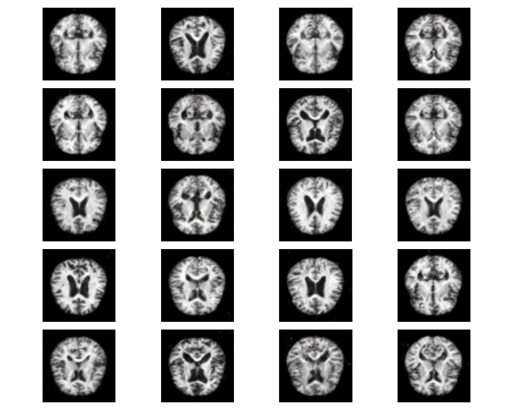

# LSGAN - Generative Adversarial Network for Custom Dataset: Least Squared GAN



## Overview

LSGAN (GAN-based Project for Synthesizing Gray-scale/RGB images) is a machine learning project focused on generating synthetic images using Generative Adversarial Networks (GANs). Specifically, it is designed to work with the Custom medical dataset, a large database of medical commonly used for training various image processing systems.

## Demo - During training


## Features

- Utilizes PyTorch for implementing GAN models.
- Provides scripts for easy training and generating synthetic images.
- Command Line Interface for easy interaction.
- Includes a custom data loader for the custom medical image dataset.
- Customizable training parameters for experimenting with GAN.

## Installation

Clone the repository:

```
git clone https://github.com/atikul-islam-sajib/LSGAN
cd LSGAN
```

# Install dependencies

```
pip install -r requirements.txt
```

## Usage

Examples of commands and their explanations.

```bash
python /path/to/LSGAN/src/cli.py --help
```

### Options

| Option            | Description                                                  | Default Value |
|-------------------|--------------------------------------------------------------|---------------|
| `--batch_size`    | Set the batch size for the dataloader.                       | Specify if there's one |
| `--image_path`    | Define the Custom dataset.                                   | N/A           |
| `--epochs`        | Set the number of training epochs.                           | N/A           |
| `--latent_space`  | Define the size of the latent space for the model.           | N/A           |
| `--lr`            | Specify the learning rate for training the model.            | N/A           |
| `--num_samples`   | Determine the number of samples to generate after training.  | N/A           |
| `--test`          | Run tests with synthetic data to validate model performance. | N/A           |
| `--device`        | Train the model with CPU, GPU, MPS.                          | N/A           |
| `--in_channels`   | Define the channels of the image (RGB=3/GRAY=1).             | N/A           |
| `--folder`        | A flag indicating whether to clean the training and model directories before starting. | N/A |

## Core Script Usage With CUDA

```python
from src.dataloader import Loader
from src.discriminator import Discriminator
from src.generator import Generator
from src.trainer import Trainer
from src.test import Test


# Initialize the data loader with batch size
loader = Loader(
    image_path="./alzheimer.zip",batch_size=128,image_size=64)

loader.unzip_folder()
loader.create_dataloader()

# Set up the trainer with learning rate, epochs, and latent space size with cuda
trainer = Trainer(
    image_size=64,input_channels=3,latent_space=100,lr=0.0002,epochs=100,device="cuda")

trainer.train()

# Test the generated dataset with cuda

test = Test(
latent_space=100, num_samples=20, device="cuda")

test.test()

```

## Core Script Usage With MPS

```python
from src.dataloader import Loader
from src.discriminator import Discriminator
from src.generator import Generator
from src.trainer import Trainer
from src.test import Test
# Set up the trainer with learning rate, epochs, and latent space size with mps
trainer = Trainer(
    image_size=64,input_channels=3,latent_space=100,lr=0.0002,epochs=100,device="mps")

trainer.train()

# Set up the trainer with learning rate, epochs, and latent space size with cpu
trainer = Trainer(
    image_size=64,input_channels=3,latent_space=100,lr=0.0002,epochs=100,device="mps")

trainer.train()

# Test the generated dataset with cuda

test = Test(
latent_space=100, num_samples=20, device="mps")

test.test()
```

## Core Script Usage With CPU

```python
from src.dataloader import Loader
from src.discriminator import Discriminator
from src.generator import Generator
from src.trainer import Trainer
from src.test import Test

# Set up the trainer with learning rate, epochs, and latent space size with mps
trainer = Trainer(
    image_size=64,input_channels=3,latent_space=100,lr=0.0002,epochs=100,device="cpu")

trainer.train()

# Set up the trainer with learning rate, epochs, and latent space size with cpu
trainer = Trainer(
    image_size=64,input_channels=3,latent_space=100,lr=0.0002,epochs=100,device="cpu")

trainer.train()

# Test the generated dataset with cpu
test = Test(
latent_space=100, num_samples=20, device="cpu")

test.test()
```

This script initializes the data loader, Medical dataset, and prepares the data loader. It then sets up and starts the training process for the GAN model.

## Training and Generating Images

#### Training the GAN Model with CUDA, MPS, CPU

| **Device** | **Process**                              | **Command**                                                                                                                                 | **Parameters**                                                                                      |
|------------|------------------------------------------|---------------------------------------------------------------------------------------------------------------------------------------------|-----------------------------------------------------------------------------------------------------|
| **MPS**    | **Training the GAN Model with MPS**      | `python /content/LSGAN/clf.py --image_path "/path/to/dataset.zip" --batch_size 64 --image_size 64 --in_channels 3 --latent_space 100 --lr 0.0002 --epochs 10 --device mps --folder` | - `image_path`: Path to dataset <br> - `batch_size`: 64 <br> - `image_size`: 64 <br> - `in_channels`: 3 <br> - `latent_space`: 100 <br> - `lr`: 0.0002 <br> - `epochs`: 10 <br> - `device`: mps <br> - `folder`: Clean directories before start |
| **MPS**    | **Generating Images with MPS**           | `python /content/LSGAN/clf.py --test --latent_space 100 --num_samples 20 --device mps`                                                      | - `test`: Indicates testing mode <br> - `latent_space`: 100 <br> - `num_samples`: 20 <br> - `device`: mps                     |
| **CPU**    | **Training the GAN Model with CPU**      | `python /content/LSGAN/clf.py --image_path "/path/to/dataset.zip" --batch_size 64 --image_size 64 --in_channels 3 --latent_space 100 --lr 0.0002 --epochs 10 --device cpu --folder` | - `image_path`: Path to dataset <br> - `batch_size`: 64 <br> - `image_size`: 64 <br> - `in_channels`: 3 <br> - `latent_space`: 100 <br> - `lr`: 0.0002 <br> - `epochs`: 10 <br> - `device`: cpu <br> - `folder`: Clean directories before start |
| **CPU**    | **Generating Images with CPU**           | `python /content/LSGAN/clf.py --test --latent_space 100 --num_samples 20 --device cpu`                                                      | - `test`: Indicates testing mode <br> - `latent_space`: 100 <br> - `num_samples`: 20 <br> - `device`: cpu                     |

## Documentation

For detailed documentation on the implementation and usage, visit the [LSGAN Documentation](https://atikul-islam-sajib.github.io/LSGAN-deploy/).

## Contributing

Contributions to improve the project are welcome. Please follow the standard procedures for contributing to open-source projects.

## License

This project is licensed under [MIT LICENSE](./LICENSE). Please see the LICENSE file for more details.

## Acknowledgements

Thanks to all contributors and users of the LSGAN project. Special thanks to those who have provided feedback and suggestions for improvements.

## Contact

For any inquiries or suggestions, feel free to reach out to [atikulislamsajib137@gmail.com].

## Additional Information

- This project is a work in progress and subject to changes.
- Feedback and suggestions are highly appreciated.
- Courtesy: Atikul Islam Sajib

```

```


